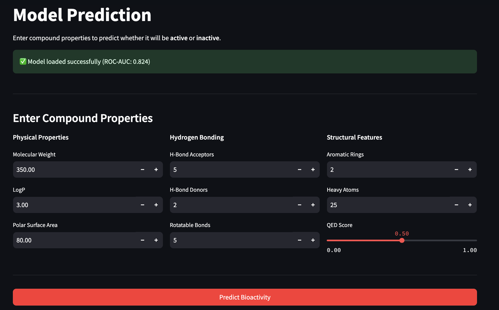
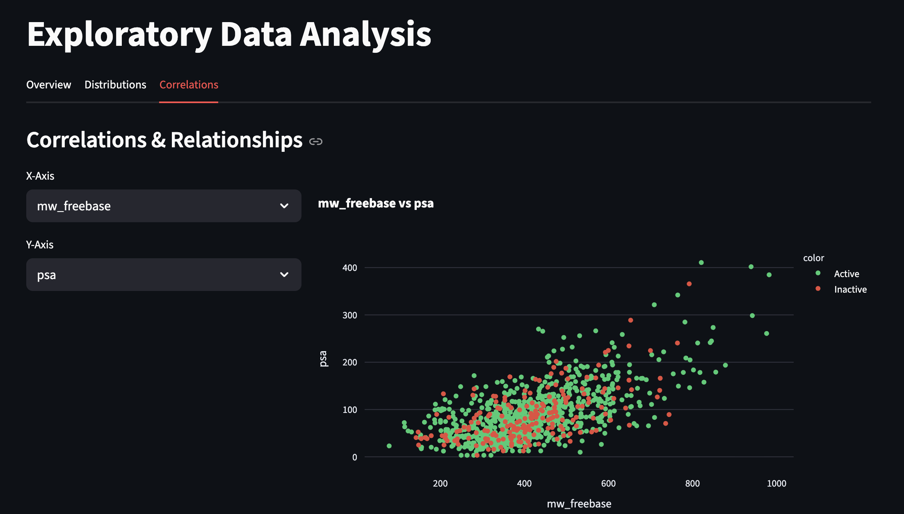
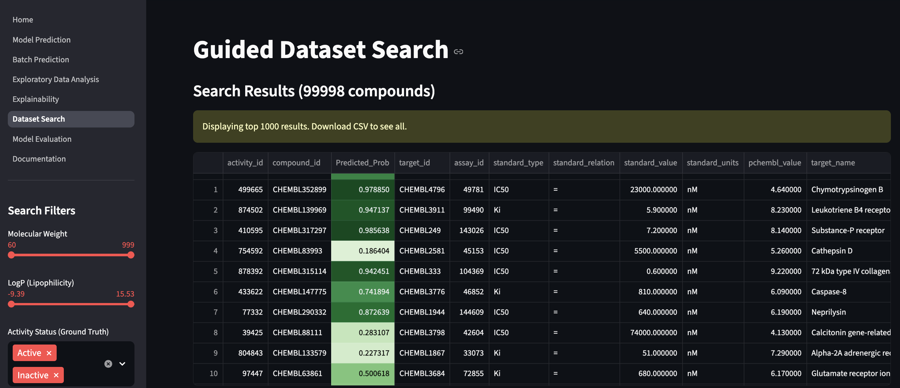

# BioInsight Lite: Bioactivity Prediction System

## Project Overview
BioInsight Lite is a machine learning application designed to explore chemical datasets and predict the bioactivity of small molecules against specific biological targets. The system leverages the ChEMBL database (v36) to train predictive models that classify compounds as "Active" or "Inactive" based on their physicochemical properties.

---

### 1. Jupyter Notebook
**Location:** `notebooks/01_workflow.ipynb`

The notebook contains the complete end-to-end workflow:
- **Data Preparation:** Loading ChEMBL data, cleaning, and feature engineering
- **Exploratory Data Analysis:** Distribution analysis, correlation heatmaps
- **Modeling:** Training Logistic Regression (baseline) and XGBoost (production model)
- **Evaluation:** ROC-AUC, Precision, Recall, F1-Score metrics
- **Explainability:** SHAP analysis for model interpretability

### 2. Streamlit Application
**Location:** `ui/`

Interactive web application with the following modules:
- **Home:** Project overview and navigation
- **Model Prediction:** Single compound bioactivity prediction
- **Batch Prediction:** Bulk CSV upload and inference
- **Exploratory Data Analysis:** Interactive visualizations
- **Explainability:** SHAP-based feature importance
- **Dataset Search:** Filter compounds and view predictions
- **Model Evaluation:** Performance metrics comparison

**Run Command:**
```bash
https://aragen-hackathon-arpita.streamlit.app/
```


## Methodology

### 1. Data Pipeline
**Source:** ChEMBL v36 database (100,000 compound samples)

**Cleaning Steps:**
- Removed entries with missing activity labels
- Dropped leakage features (`pchembl_value`, `standard_value`)
- Stratified sampling to maintain class distribution (80% Active, 20% Inactive)

### 2. Feature Engineering
Created domain-specific features to capture chemical properties:
- `mw_logp_interaction`: Molecular Weight × LogP (size-lipophilicity relationship)
- `binding_efficiency`: PSA / Molecular Weight (binding proxy)
- `complexity_score`: Aromatic Rings + Heavy Atoms + Rotatable Bonds

**Input Features:**
- Molecular Weight, LogP, Polar Surface Area (PSA)
- H-Bond Acceptors/Donors, Rotatable Bonds
- Aromatic Rings, Heavy Atoms, QED Score

### 3. Preprocessing
- **Imputation:** Missing values filled with domain-specific defaults
- **Scaling:** StandardScaler applied to all numerical features
- **Encoding:** Label encoding for categorical variables

### 4. Model Development

#### Baseline: Logistic Regression
- Simple linear decision boundary
- Interpretable coefficients
- **ROC-AUC:** 0.663

#### Production: XGBoost Classifier
- Gradient boosted decision trees
- Hyperparameters: 200 estimators, max_depth=6, learning_rate=0.05
- **ROC-AUC:** 0.824 ✅ (Selected for deployment)

### 5. Evaluation Strategy
- **Train/Test Split:** 80/20 stratified split
- **Cross-Validation:** 5-fold CV for robustness check
- **Metrics:** ROC-AUC, Accuracy, Precision, Recall, F1-Score

### 6. Explainability
- **SHAP (SHapley Additive exPlanations):** Integrated for global and local feature importance
- Provides transparency for why a compound is predicted as Active/Inactive

---

## Model Performance Metrics

| Model                | ROC-AUC | Accuracy | Precision | Recall |
|---------------------|---------|----------|-----------|--------|
| Logistic Regression | 0.663   | ~0.75    | ~0.72     | ~0.78  |
| **XGBoost**         | **0.824** | **~0.82** | **~0.80** | **~0.84** |

**Winner:** XGBoost (Selected for Production)

---

## Technology Stack

- **Programming Language:** Python 3.9+
- **Web Framework:** Streamlit
- **Machine Learning:** Scikit-learn, XGBoost
- **Explainability:** SHAP
- **Data Manipulation:** Pandas, NumPy
- **Visualization:** Plotly, Matplotlib, Seaborn
- **Database/Data Source:** ChEMBL v36 (CSV Extract)

---

## Project Architecture

```
bioinsight_hackathon2/
├── data/
│   ├── sample_bioactivity.csv      # Processed dataset (100k samples)
│   └── extract_sample.py           # Data extraction script
├── models/
│   ├── train_models.py             # Training pipeline script
│   └── saved/                      # Serialized model artifacts
│       ├── xgboost.pkl             # Production Model
│       ├── logreg.pkl              # Baseline Model
│       ├── scaler.pkl              # Feature Scaler
│       └── label_encoders.pkl      # Categorical Encoders
├── notebooks/
│   └── 01_workflow.ipynb           # End-to-end analysis notebook
├── ui/
│   ├── Home.py                     # Application Entry Point
│   ├── pages/
│   │   ├── 1_Model_Prediction.py   # Single compound inference
│   │   ├── 2_Batch_Prediction.py   # Bulk CSV inference
│   │   ├── 3_Exploratory_Data_Analysis.py
│   │   ├── 4_Explainability.py     # SHAP analysis
│   │   ├── 5_Dataset_Search.py     # Filter & Predict tool
│   │   └── 6_Model_Evaluation.py   # Performance metrics
│   └── utils/
│       ├── preprocessing.py        # Feature engineering
│       ├── model_loader.py         # Model singleton
│       └── visualizations.py       # Plotly charts
├── requirements.txt                # Python dependencies
└── README.md                       # This file
```

---

## Installation & Usage

### Prerequisites
- Python 3.9 or higher
- pip package manager

### Setup Instructions

1. **Clone the repository:**
   ```bash
   git clone https://github.com/Arpitaa19/Assessment---Aragen.git
   cd bioinsight_hackathon2
   ```

2. **Install dependencies:**
   ```bash
   pip install -r requirements.txt
   ```

3. **Run the Streamlit application:**
   ```bash
   python3 -m streamlit run ui/Home.py
   ```

4. **Access the Dashboard:**
   Open your browser to `http://localhost:8501`

---

## Screenshots

### 1. Model Prediction

*Single compound prediction interface with confidence scores*

### 2. Exploratory Data Analysis

*Interactive data visualizations and distributions*

### 3. Dataset Search

*Filter compounds and view real-time predictions*

### 4. Model Evaluation

*Performance metrics comparison (LogReg vs XGBoost)*

---


Presentation link: https://drive.google.com/file/d/1qBbZd6oNxTKXoJwhHfPB1lU6kikPgmbn/view?usp=sharing


**Submission for Aragen Hackathon**
